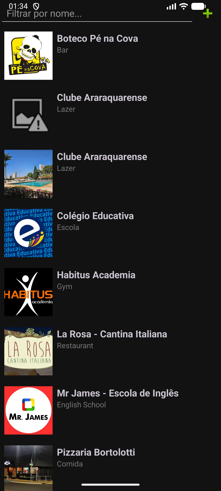
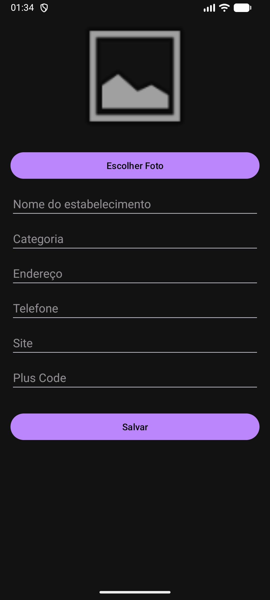
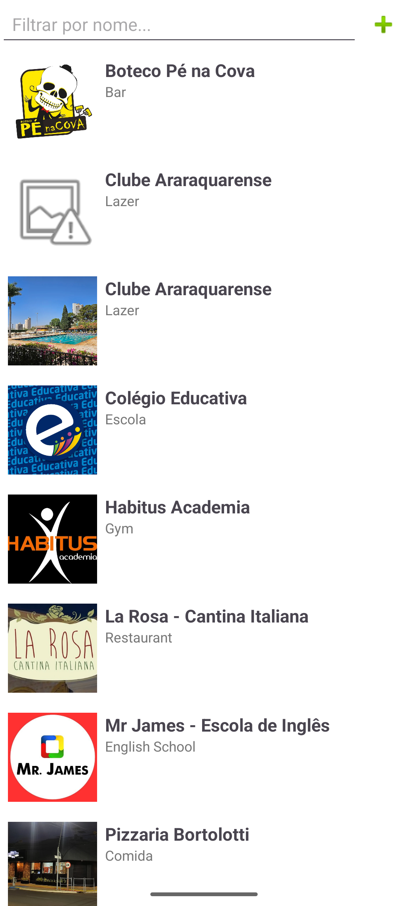
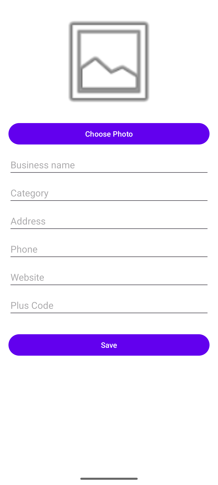

# Estabelecimentos do Carmo – App v2

Um aplicativo Android desenvolvido em **Kotlin** que lista estabelecimentos do bairro, permite adicionar novos manualmente, filtrar por nome e visualizar detalhes como telefone, site e localização no mapa.  
O projeto foi criado para fins didáticos, utilizando **Android Studio**, **Room Database**, **RecyclerView**, **ViewBinding** e **Kotlin Coroutines**, além de suporte a **Material Design** com tema Day/Night.

---

## 📱 Funcionalidades

- **Listagem de estabelecimentos** com nome, categoria e imagem  
- **Tela de detalhes** ao clicar em um item, exibindo todas as informações  
- **Campos clicáveis** na tela de detalhes:  
  - Telefone → abre o discador  
  - Endereço → abre o Google Maps  
  - Site → abre o navegador  
  - Plus Code → abre o Google Maps  
- **Adicionar novo estabelecimento** com foto e informações completas  
- **Filtro por nome** em tempo real  
- **Dados iniciais** já populados no banco de dados  
- Suporte total a **modo escuro (Dark Theme)**  
- Internacionalização (Português/Inglês)

---

## 🏗️ Tecnologias Utilizadas

- **Linguagem:** Kotlin  
- **IDE:** Android Studio  
- **Arquitetura:** Room + Repository + DAO + Activities  
- **UI:** Material Components + RecyclerView + ViewBinding  
- **Banco de Dados:** Room Database com dados iniciais  
- **Assíncrono:** Kotlin Coroutines (Dispatchers IO/Main)  
- **Internacionalização:** `values/` e `values-pt-rBR/`  
- **Temas:** `Theme.MaterialComponents.DayNight`

---

## 🚀 Como Executar o Projeto

1. **Clone este repositório:**
   ```bash
   git clone https://github.com/mathmct/EstabelecimentosDoCarmo.git

   
## Demonstração do App - CLIQUE PARA ASSISTIR
[](https://www.youtube.com/shorts/eOGkmQFnp3c)

## Video Longo Explicativo (Em Ingles) - CLIQUE PARA ASSISTIR
[](https://www.youtube.com/watch?v=mq_nuGglWRE)

## Capturas de Tela

| 🇧🇷 Modo Noturno | 🇧🇷 Modo Noturno (Cadastro) | 🇺🇸 Modo Dia | 🇺🇸 Modo Dia (Cadastro) |
|:----------------:|:---------------------------:|:-------------:|:------------------------:|
|  |  |  |  |


