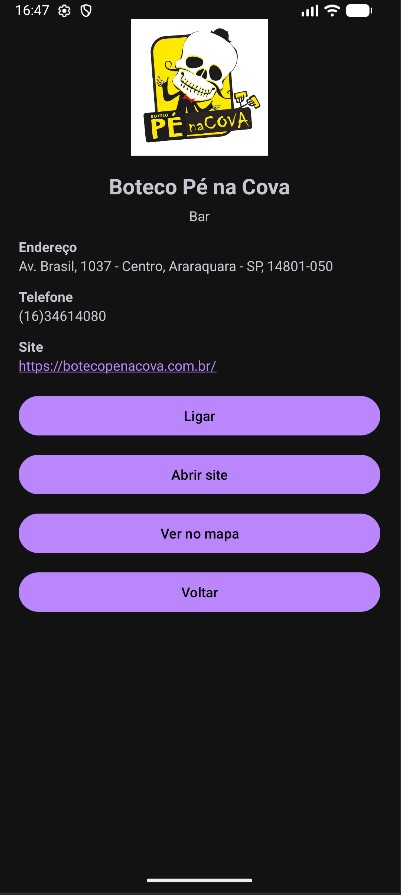
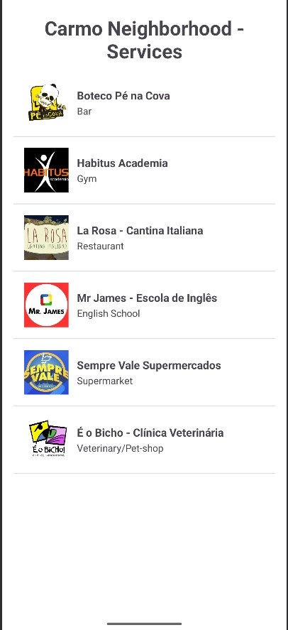
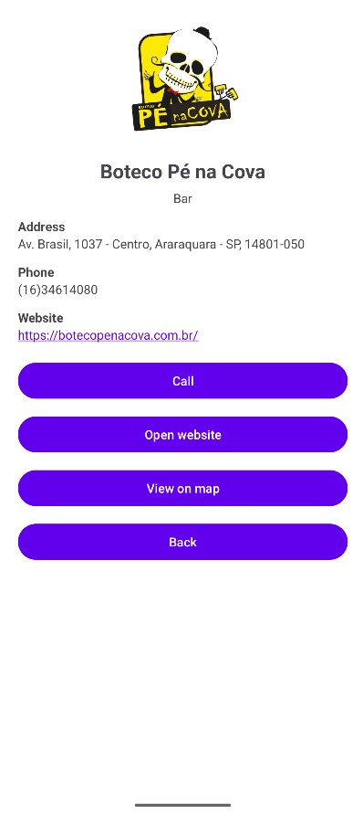

# Estabelecimentos do Carmo

Um aplicativo Android simples desenvolvido em **Kotlin** que lista estabelecimentos do bairro e permite visualizar detalhes como telefone, site e localização no mapa.  
O projeto foi criado para fins didáticos, utilizando **Android Studio** e os principais componentes de interface moderna (Material Design + tema Day/Night).

---

## Funcionalidades

-  Listagem de estabelecimentos com nome e imagem  
-  Tela de detalhes ao clicar em um estabelecimento  
-  Botões para:
   Ligar diretamente para o local  
   Abrir o site oficial  
   Ver a localização no Google Maps  
-  Suporte total a **modo escuro (Dark Theme)**  
-  Internacionalização (Português/Inglês)

---

## Tecnologias Utilizadas

- **Linguagem:** Kotlin  
- **IDE:** Android Studio  
- **Arquitetura:** Activity + Intent  
- **UI:** Material Components  
- **Internacionalização:** `values/` e `values-pt-rBR/`  
- **Temas:** `Theme.MaterialComponents.DayNight`

---

## Como Executar o Projeto

1. **Clone este repositório:**
   ```bash
   git clone https://github.com/seuusuario/EstabelecimentosDoCarmo.git
   
## Demonstração do App - CLIQUE PARA ASSISTIR
[](https://www.youtube.com/shorts/iY1STMTAqUo)

## Capturas de Tela

| 🇧🇷 Modo Noturno | 🇧🇷 Modo Noturno (detalhes) | 🇺🇸 Modo Dia | 🇺🇸 Modo Dia (detalhes) |
|:----------------:|:---------------------------:|:-------------:|:------------------------:|
|  |  |  |  |


